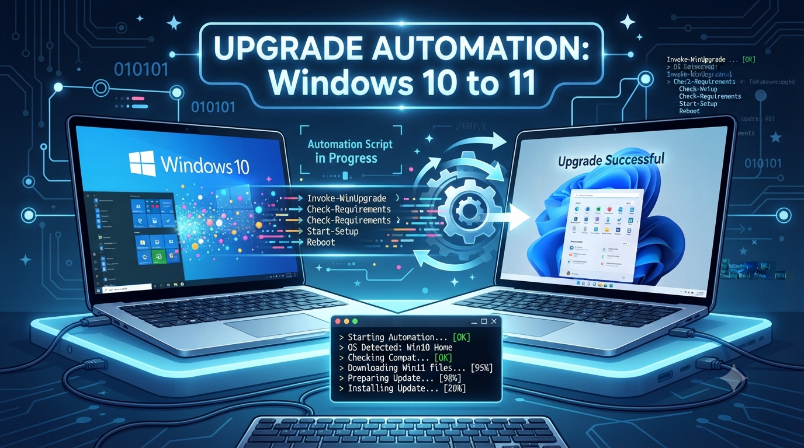

<a name="readme-top"></a>

<!-- PROJECT LOGO -->
<br />
<div align="center">
  <a href="[https://github.com/IT-BASCO/UPGRADE-AUTOMATION-Windows-10-to-11](https://github.com/IT-BASCO/UPGRADE-AUTOMATION-Windows-10-to-11)">
    
  </a>

  <h3 align="center">UPGRADE-AUTOMATION-Windows-10-to-11</h3>

  <p align="left">
    <strong>⚡ Enterprise Infrastructure Automation:</strong> A zero-touch deployment framework designed to orchestrate and automate seamless, remote in-place migrations from Windows 10 to Windows 11 via Active Directory GPOs.
    <br />
    <br />
    <strong>⚙️ The 5-Script Pipeline:</strong> Dynamically handles proactive local disk optimization, extracts and strips installation telemetry to safely bypass rigid TPM 2.0/CPU hardware blocks, and silently reinstalls core endpoint management agents with zero user disruption.
    <br />
  </p>
  <p align="center">
    <a href="https://github.com/IT-BASCO/UPGRADE-AUTOMATION-Windows-10-to-11"><strong>Explore the docs »</strong></a>
    <br />
    <br />
    <a href="https://github.com/IT-BASCO/UPGRADE-AUTOMATION-Windows-10-to-11">View Demo</a>
    ·
    <a href="https://github.com/IT-BASCO/UPGRADE-AUTOMATION-Windows-10-to-11/issues/new?labels=bug&template=bug-report---.md">Report Bug</a>
    ·
    <a href="https://github.com/IT-BASCO/UPGRADE-AUTOMATION-Windows-10-to-11/issues/new?labels=enhancement&template=feature-request---.md">Request Feature</a>
  </p>
</div>

<!-- TABLE OF CONTENTS -->
## Table of Contents

* [🏢 About The Project](#about-the-project)
* [🚀 Getting Started](#getting-started)
    * [Prerequisites](#prerequisites)
    * [Configuration & Deployment](#configuration--deployment)
    * [ISO Media & Telemetry Bypass Preparation](#iso-media--telemetry-bypass-preparation)
* [⚙️ Framework Pipeline Stages](#framework-pipeline-stages)
    * [Stage 1: Disk Space Optimization](#stage-1-disk-space-optimization)
    * [Stage 2: Registry Safeguard](#stage-2-registry-safeguard)
    * [Stage 3: In-Place Migration Engine](#stage-3-in-place-migration-engine)
    * [Stage 4: Post-Deployment Agent Healing](#stage-4-post-deployment-agent-healing)
    * [Stage 5: Post-Upgrade Storage Reclaimer](#stage-5-post-upgrade-storage-reclaimer)
* [🛡️ Security & Compliance](#security--compliance)
* [💻 Usage](#usage)
* [🤝 Contributing](#contributing)
* [📜 License](#license)
* [📧 Contact](#contact)
* [✨ Acknowledgments](#acknowledgments)

<!-- ABOUT THE PROJECT -->
<a name="about-the-project"></a>
# 🏢 About The Project

Following the End-of-Life (EOL) announcement for Windows 10, large enterprises face critical security and compliance risks. Manually upgrading a decentralized fleet of endpoints introduces staggering operational bottlenecks. 

This project shifts infrastructure operations from traditional, high-risk manual updates to a deterministic, **fully automated background deployment pipeline**. By dynamically bypassing hardware checks, transforming LTSC environments to standard enterprise editions, and ensuring post-migration agent persistence, this framework solves the upgrade lifecycle with zero user disruption and zero graphical pop-ups.

### ⚡ The Enterprise Challenge Solved

* **Massive Geographical Dispersion:** Deploying updates across extensive industrial complexes spanning over **650 hectares** makes manual technician intervention logistically impossible.
* **Manpower & Resource Constraints:** Limited IT infrastructure personnel to handle a large fleet of active client nodes (**~170 systems**) simultaneously.
* **Hardware Incompatibility Obstacles:** Legacy workstations failing strict Windows 11 hardware checks (TPM 2.0, Secure Boot, unsupported legacy Core i3 CPU generations).
* **Capital Expenditure (CAPEX) Restrictions:** High hardware procurement costs avoided by circumventing forced hardware replacements and manual BIOS upgrades.

<a name="build-with"></a>
### 🛠️ Built With

* [![PowerShell][PowerShell-shield]][PowerShell-url]
* [![Windows][Windows-shield]][Windows-url]

<p align="right">(<a href="#readme-top">back to top</a>)</p>

<!-- GETTING STARTED -->
<a name="getting-started"></a>
# 🚀 Getting Started

> **⚠️ WARNING: Use at Your Own Risk**
> This framework performs deep-level modifications to the Windows registry and OS installation parameters. It is intended for authorized IT administrators only. 
> * **Always test in a non-production, isolated sandbox environment first.**
> * **Ensure a verified full-system backup exists before deployment.**
> * The authors assume no liability for data loss or system instability.

<a name="prerequisites"></a>
### 📋 Prerequisites

* **Backup:** Create a full-system backup or snapshot before executing the pipeline.
* **Permissions:** Administrative privileges (SYSTEM or Local Admin account).
* **Network:** Stable connectivity to the central File Share containing the ISO and Agent payloads.
* **Target:** Windows 10 (Pro/Enterprise/LTSC) systems.

<a name="configuration--deployment"></a>
### 🛠️ Configuration & Deployment

1. Clone the repository and navigate to the `src/` directory.
2. Open `02-Registry-Safeguard.bat` and `03-Migration-Engine.bat` to customize your centralized update share paths:
   ```batch
   set "CENTRAL_UPDATE_SHARE=\\<YOUR_FILE_SERVER_IP>\update"
   set "KMS_SERVER=kms.yourdomain.com"
   ```
3. Open `04-Agent-Healing.ps1` to adjust your infrastructure logging parameters:
   ```powershell
   param(
       [string]$SourceShare = "\\<YOUR_FILE_SERVER_IP>\update\agents",
       [string]$LogRoot = "\\<YOUR_FILE_SERVER_IP>\update\logs\agents"
   )
   ```

<a name="iso-media--telemetry-bypass-preparation"></a>
### 📀 ISO Media & Telemetry Bypass Preparation (Mandatory Pre-requisites)

Before executing the upgrade pipeline on target network endpoints, you must extract the Windows 11 25H2 installation media to your centralized network share and forcefully neutralize Microsoft's mandatory hardware restrictions:

1. **Extract the Windows 11 25H2 ISO Image:** Use command-line 7-Zip (`7z`) to extract the official operating system image directly into your designated network update share directory:
   ```cmd
   7z x "\\Corp-Share\ISOs\Win11_25H2.iso" -o"G:\update\win11up25h2" -y
   ```

2. **Neutralize and Bypass Hardware Assessment Telemetry:** Navigate to the extracted `sources` folder, rename the native telemetry assessment library to create a backup, and replace it with a blank, 0-byte dummy file. This forcefully strips the installation engine of its ability to enforce hardware checks mid-execution:
   ```cmd
   cd G:\update\win11up25h2\sources
   ren appraiserres.dll appraiserres.dll.bak
   echo. > appraiserres.dll
   ```

3. **Inject Hardware Verification Bypass Keys:** The migration pipeline applies strategic registry spoofing values to ensure the OS installation engine registers full environment compliance across legacy architectures:
   ```batch
   reg add "HKLM\SYSTEM\Setup\MoSetup" /v AllowUpgradesWithUnsupportedTPMOrCPU /t REG_DWORD /d 1 /f
   reg add "HKLM\SOFTWARE\Microsoft\Windows NT\CurrentVersion\AppCompatFlags\HwReqChk" /v HwReqChkVars /t REG_MULTI_SZ /s , /d "SQ_SecureBootCapable=TRUE,SQ_SecureBootEnabled=TRUE,SQ_TpmVersion=2,SQ_RamMB=8192," /f
   ```

<p align="right">(<a href="#readme-top">back to top</a>)</p>

---

<!-- FRAMEWORK PIPELINE STAGES -->
<a name="framework-pipeline-stages"></a>
# ⚙️ Framework Pipeline Stages

The architecture consists of 5 sequential execution stages located in the `src/` folder:

```text
[Target Endpoint]
       │
       ├──► Stage 1: 01-Disk-Optimizer.ps1       (Reclaims capacity, analyzes profiles)
       ├──► Stage 2: 02-Registry-Safeguard.bat    (Locale-independent HKLM registry backup)
       ├──► Stage 3: 03-Migration-Engine.bat      (TPM bypass, LTSC morphing, silent OS upgrade)
       ├──► Stage 4: 04-Agent-Healing.ps1         (Zero-GUI, asynchronous security agent injection)
       └──► Stage 5: 05-Post-Upgrade-Cleanup.bat  (Deep purge of Windows.old & setup caches)
```

<a name="stage-1-disk-space-optimization"></a>
### 🦾 Stage 1: Disk Space Optimization (`01-Disk-Optimizer.ps1`)
* **Purpose:** Proactively prepares the local primary volume for the heavy upgrade footprint.
* **Mechanics:** Performs deep analytical sweeps of user profiles, archives massive duplicate or stagnant folders, cleans temporary update storage blocks, and generates automated local reports before signaling readiness.

<a name="stage-2-registry-safeguard"></a>
### 🛡️ Stage 2: Registry Safeguard (`02-Registry-Safeguard.bat`)
* **Purpose:** Ensures high-availability system resilience before major OS modifications.
* **Mechanics:** Executes a native registry export of the core `HKLM` hives. Utilizes a **Base-PowerShell parsing engine** to extract date metrics, successfully bypassing legacy DOS date parsing bugs commonly triggered by Persian/Solar Hijri or local system regional settings.

<a name="stage-3-in-place-migration-engine"></a>
### ⚙️ Stage 3: In-Place Migration Engine (`03-Migration-Engine.bat`)
* **Purpose:** The central core that performs the unattended upgrade payload injection.
* **Mechanics:**
  * Instantly blocks deployment on critical Windows Servers to prevent domain controller or infrastructure corruption.
  * Leverages extracted ISO media and completely disarms the Microsoft hardware assessment telemetry layer by stripping and zero-byte spoofing `appraiserres.dll`.[cite: 1]
  * Circumvents rigid Windows 11 TPM 2.0, Secure Boot, and CPU generation blocks via proactive `MoSetup` and `HwReqChk` registry spoofing injections.[cite: 1]
  * Dynamically detects **Windows 10 LTSC** versions and temporarily morphs their identity parameters to standard Enterprise, preventing the classic upgrade blockade.
  * Flushes legacy licensing keys and reinjects standard Enterprise GVLKs aligned with central KMS activation servers.

<a name="stage-4-post-deployment-agent-healing"></a>
### 🧪 Stage 4: Post-Deployment Agent Healing (`04-Agent-Healing.ps1`)
* **Purpose:** Re-establishes corporate visibility, endpoint management, and security posture instantly upon OS boot.
* **Mechanics:** Runs completely headless (`WindowStyle Hidden` / `Zero-GUI`) without disrupting the active user or throwing security pop-ups. Scans, reinstalls, and validates the running health of critical corporate background daemons:
  * **ManageEngine UEMS** (`DesktopCentralAgent`)
  * **ManageEngine OpManager** (`OpManagerAgent`)
  * **Symantec Endpoint Protection** (`SepMasterService`)
  * **NetSupport Support Client** (`Client32`)

<a name="stage-5-post-upgrade-storage-reclaimer"></a>
### 🧹 Stage 5: Post-Upgrade Storage Reclaimer (`05-Post-Upgrade-Cleanup.bat`)
* **Purpose:** Final cleanup phase executed days after verified endpoint stability to recover storage.
* **Mechanics:** Overrides advanced system file permissions using automated `takeown` and administrative `icacls` pipelines. Safely forces the destruction of heavy legacy artifacts including `C:\Windows.old`, `$WINDOWS.~BT`, `$WINDOWS.~WS`, diagnostic `Win11Logs`, and telemetry-heavy Panther setup dumps, followed by an automated system realignment reboot.

<p align="right">(<a href="#readme-top">back to top</a>)</p>

---

<!-- Security & Compliance-->
<a name="security--compliance"></a>
# 🛡️ Security & Compliance
* **Privilege Requirements:** The framework executes with local Administrator privileges strictly to perform authorized system modifications.
* **Integrity & Transparency:** All scripts are open-source and human-readable. No obfuscated binaries or hidden payloads are executed, ensuring full auditability of the migration process.
* **Data Privacy:** This tool operates entirely within your network perimeter. **Zero telemetry, system metadata, or user data is transmitted to external servers.**
* **Auditability:** Every execution step is timestamped and logged locally in `C:\Logs`. These logs are designed to be ingested by centralized log management solutions for enterprise-wide compliance tracking.
* **Non-Persistent:** The framework does not introduce permanent backdoors; it only deploys the essential management agents required for endpoint health.

<p align="right">(<a href="#readme-top">back to top</a>)</p>

<!-- USAGE EXAMPLES -->
<a name="usage"></a>
# 💻 Usage
This framework is designed for sequential execution. You can orchestrate the deployment using Active Directory Group Policy Objects (GPOs), System Startup Scripts, or your centralized Endpoint Management software (e.g., ManageEngine, SCCM, PDQ).

### Monitoring & Log Analysis
The system automatically writes a summary status to the central repository file share.

**Log Format Example:**
[2026-07-07 10:46:17] [WIN10-FREE2-84] [V12.8] [SUMMARY] Final Status -> EC: OK, OM: OK, SYM: OK, NS: OK

**Status Key:**
* **EC:** Endpoint Centeral
* **OM:** Opmanager
* **SYM:** Symantec Endpoint Protection Agent
* **NS:** NetSupport Client
<p align="right">(<a href="#readme-top">back to top</a>)</p>

<!-- ROADMAP -->
<a name="roadmap"></a>

<!-- CONTRIBUTING -->
<a name="contributing"></a>
# 🤝 Contributing

Contributions are greatly appreciated. Please see our [CONTRIBUTING.md](CONTRIBUTING.md) file.

<p align="right">(<a href="#readme-top">back to top</a>)</p>

<!-- LICENSE -->
<a name="license"></a>
# 📜 License
Distributed under the **MIT License**. See `LICENSE` for more information.

<p align="right">(<a href="#readme-top">back to top</a>)</p>

<!-- CONTACT -->
<a name="contact"></a>
# 📧 Contact

**Lead Systems Administrators:**

* **Vahid Soltaninejad** | [linkedin](https://linkedin.com/in/vahid-soltani-nejad) | `vsntxt@gmail.com`

* **Mohammad Absalan** | [linkedin](https://linkedin.com/in/mohammad-absalan) | `absalan95mohammad@gmail.com`

* **Afsaneh SHarafi** | [linkedin](https://linkedin.com/in/afsaneh-sharafi) | `afsanehsharafi00@gmail.com`

<p align="right">(<a href="#readme-top">back to top</a>)</p>

<!-- ACKNOWLEDGMENTS -->
<a name="acknowledgments"></a>
# ✨ Acknowledgments

* Dedicated to the open-source community, whose shared knowledge in automation and system administration makes enterprise operations more efficient.
* Thanks to all the contributors and colleagues who helped validate and refine the scripts within this repository.


<p align="right">(<a href="#readme-top">back to top</a>)</p>

<!-- MARKDOWN LINKS & IMAGES -->
[PowerShell-shield]: https://img.shields.io/badge/PowerShell-%235391FE.svg?style=plastic&logo=powershell&logoColor=white
[PowerShell-url]: https://learn.microsoft.com/en-us/powershell/
[Windows-shield]: https://img.shields.io/badge/Windows-0078D6?style=plastic&logo=windows&logoColor=white
[Windows-url]: https://www.microsoft.com/windows
